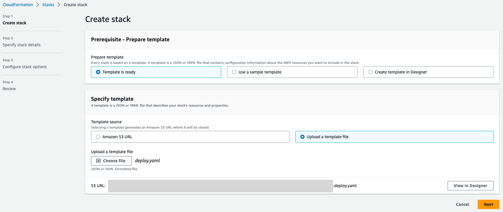

# Single Account Security Accelerator

At AWS, security is our top priority. The Single Account Security Accelerator (SASA) provides a quick way to improve your security posture in a single-account environment. We recommend that customers use multiple accounts as described in the [Organizing your AWS environments using multiple accounts AWS Whitepaper](https://docs.aws.amazon.com/whitepapers/latest/organizing-your-aws-environment/organizing-your-aws-environment.html) and the use of designated security accounts as described in the [Security Reference Architecture](https://docs.aws.amazon.com/prescriptive-guidance/latest/security-reference-architecture/architecture.html).

The Single Account Security Accelerator (SASA) is for customers that cannot adopt a multi-account strategy. This may be customers getting started on AWS or customers that are managing a single workload. SASA is intended for customers in the beginning phases of the [AWS Security Maturity Model](https://maturitymodel.security.aws.dev/en/model/).

This solution checks for and enables the following services:
- [Amazon GuardDuty](https://aws.amazon.com/guardduty/) for threat detection.
- [AWS Security Hub](https://aws.amazon.com/security-hub/) to aggregate alerts and automate best practice checks.
- [AWS Config](https://aws.amazon.com/config/) to track resource configuration changes and support Security Hub best practice checks.
- [Amazon CloudTrail](https://aws.amazon.com/cloudtrail/) to track user activity and API usage.

SASA will setup an [Amazon SNS](https://aws.amazon.com/sns/) topic to send the following notifications:
- High or medium severity GuardDuty findings
- Daily (or as configured) summary emails of the top 10 Critical and High Security Hub recommendations.

Security Hub enables two best practice standards by default.
  - AWS Foundational Security Best Practices ([FSBP](https://docs.aws.amazon.com/securityhub/latest/userguide/fsbp-standard.html))
  - Center for Internet Security (CIS) v1.2 [AWS Foundation Benchmark](https://docs.aws.amazon.com/securityhub/latest/userguide/cis-aws-foundations-benchmark.html)

## Architecture overview


## Prerequisites
 - Access to an AWS user with sufficient permissions
 - An email address to receive security findings, preferably one that can be accessed by multiple people to reduce single points of failure

## Deployment
Single Account Security Accelerator (SASA) is designed to be deployed to a single account. You must deploy the template in each Region you want to monitor. As a best practice, you should monitor each Region in a single account environment. For customers with multiple accounts, you may consider a [service control policy to deny access to the Region](https://docs.aws.amazon.com/organizations/latest/userguide/orgs_manage_policies_scps_examples_general.html#example-scp-deny-region) as a mitigating control.

|Deployment Type|AWS CloudShell|AWS console|
| --- | --- | --- |
| Multi-region | [Link (recommended)](#aws-cloudshell) | [Link](#aws-console) |
| Single Region | [Link](#aws-cloudshell-1) | [Link](#aws-console-1) |

### Multi-Region
To deploy Single Account Security Accelerator to all Regions in your account, follow these steps.

#### AWS CloudShell
<details>

**Step 1**: Deploy the CloudFormation template to create prerequisite roles.
This step deploys AWSCloudFormationStackSetAdministrationRole and AWSCloudFormationStackSetExecutionRole to deploy CloudFormation StackSets.

1. To download the template, open AWS CloudShell in the Region where you want to aggregate findings (main Region) and enter the following command. 

```bash
wget https://raw.githubusercontent.com/aws-samples/single-account-security-accelerator/main/1-prerequisite-roles.yaml
```

2. To deploy the CloudFormation template to create the prerequisite roles, enter the following command.
   - $AWS_REGION will be automatically replaced with the Region you are running AWS CloudShell in.

```bash
aws cloudformation deploy --template-file 1-prerequisite-roles.yaml \
--stack-name CloudFormation-StackSet-roles \
--region $AWS_REGION \
--capabilities CAPABILITY_NAMED_IAM
```

Note: If you get an error that `AWSCloudFormationStackSetExecutionRole already exists`, it is possible that the StackSet permissions have already been setup in your account. For more information, visit [Prerequisites for stack set operations](https://docs.aws.amazon.com/AWSCloudFormation/latest/UserGuide/stacksets-prereqs.html) in the AWS CloudFormation User Guide. Continue to Step 2. 

**Step 2**: Deploy the CloudFormation template to deploy the Single Account Security Accelerator.
This step deploys the solution to all Regions in your account.

1. To download the template, open AWS CloudShell in the Region where you want to aggregate findings (main Region) and enter the following command. 

```bash
wget https://raw.githubusercontent.com/aws-samples/single-account-security-accelerator/main/2-deploy.yaml
```

2. To deploy the template, enter the following command.
   - Replace **\<email\>** with the email to receive GuardDuty and Security Hub findings.
   - $AWS_REGION will be automatically replaced with the Region you are running AWS CloudShell in.

```bash
aws cloudformation create-stack-set --template-body file://2-deploy.yaml \
--stack-set-name SASA-MR \
--permission-model SELF_MANAGED \
--capabilities CAPABILITY_NAMED_IAM \
--parameters ParameterKey=pEmailNotification,ParameterValue=<email> ParameterKey=pHomeRegion,ParameterValue=$AWS_REGION \
--region $AWS_REGION
```

3. Use the following command to create a stack instances for each enabled Region in your account.

```bash
aws cloudformation create-stack-instances --stack-set-name SASA-MR \
--accounts $(aws sts get-caller-identity --query "Account" --output text)  \
--regions $(aws ec2 describe-regions --query "Regions[].RegionName" --output text) \
--operation-preferences RegionConcurrencyType=PARALLEL,FailureTolerancePercentage=100,MaxConcurrentPercentage=100 \
--region $AWS_REGION
```

</details>

#### AWS Console
<details>

**Step 1**: Deploy the CloudFormation template to create prerequisite roles.
This step deploys AWSCloudFormationStackSetAdministrationRole and AWSCloudFormationStackSetExecutionRole to deploy CloudFormation StackSets. If you already have these roles configured, you can skip step 1.

1. Download the [1-prerequisite-roles.yaml](https://raw.githubusercontent.com/aws-samples/single-account-security-accelerator/main/1-prerequisite-roles.yaml) CloudFormation template.
2. Navigate to the [AWS CloudFormation console](https://console.aws.amazon.com/cloudformation).
3. In the navigation pane, choose **Stacks**.
4. Choose **Create stack**.
5. Under Specify template, select **Upload a template file** and choose **1-prerequisite-roles.yaml** you downloaded in step 1.
6. Choose **Next**.
7. For Stack name, enter **CloudFormation-StackSet-roles**.
8. Choose **Next**.
9.  On the Configure stack options page, choose **Next**. 
10. On the **Review** page, select the box **I acknowledge that AWS CloudFormation might create IAM resources with custom names.** and choose **Submit**.

Note: If you get an error that `AWSCloudFormationStackSetExecutionRole already exists`, it is possible that the StackSet permissions have already been setup in your account. For more information, visit [Prerequisites for stack set operations](https://docs.aws.amazon.com/AWSCloudFormation/latest/UserGuide/stacksets-prereqs.html) in the AWS CloudFormation User Guide. Continue to Step 2.

**Step 2**: Deploy the CloudFormation template to deploy the Single Account Security Accelerator.
This step deploys the solution to all Regions in your account.

1. Download the [2-deploy.yaml](https://raw.githubusercontent.com/aws-samples/single-account-security-accelerator/main/2-deploy.yaml) CloudFormation template.
2. Navigate to the [AWS CloudFormation console](https://console.aws.amazon.com/cloudformation).
3. In the navigation pane, choose **StackSets**.
4. Choose **Create StackSet**.
5. Under Specify template, select **Upload a template file**.
6. Choose **2-deploy.yaml** you downloaded in step 1.
7. For Stack name, enter **SASA-MR**.
8. For Parameters, enter the following:
   1. pEmailNotification - The email address to receive GuardDuty and Security Hub findings.
   2. pEnableSecurityServicesRate - The frequency (cron syntax) to check and enable the security services included in the solution. The default cron syntax is daily at 8am PDT.
   3. pHomeRegion - Enter the Region where you want to consolidate alerting. If you are deploying in a single Region, enter that Region.
   4. pSecurityHubEmailsRate - The frequency (cron syntax) to receive the top 10 critical and high Security Hub findings. The default cron syntax is daily at 10am PDT.
9. 
   

  - For more information on the cron syntax, visit the [Cron specifications](https://docs.aws.amazon.com/lambda/latest/dg/services-cloudwatchevents-expressions.html) in the AWS Documentation.
10. Choose **Next**.
11. On the Configure StackSet options page, choose **Next**. 
12. On the Set deployment options, enter the following:
    1.  For **Accounts** enter your 12 digit account number.
    2.  For **Specify regions**, choose the Regions you have enabled. There are 17 Regions enabled by default. For more information, visit the [Amazon EC2 guide](https://docs.aws.amazon.com/AWSEC2/latest/UserGuide/using-regions-availability-zones.html).
        
    3.  Under **Deployment options**, for **Failure tolerance**, enter **100**.
    4.  For **Region Concurrency**, choose **Parallel**.
13. Choose **Next**.
14. On the **Review** page, select the box **I acknowledge that AWS CloudFormation might create IAM resources.** and choose **Submit**.

</details>

### Single Region
To deploy the Single Account Security Accelerator in a single Region, follow the steps below. You may want to do this for testing, before you monitor each Region.

#### AWS CloudShell
<details>

1. To download the template, open AWS CloudShell in the Region where you want to monitor and enter the following command. 

```bash
wget https://raw.githubusercontent.com/aws-samples/single-account-security-accelerator/main/2-deploy.yaml
```

2. To deploy the template, enter the following command. 
   - Replace **\<email\>** with the email to receive GuardDuty and Security Hub findings.
   - $AWS_REGION will be automatically replaced with the Region you are running AWS CloudShell in.

```bash
aws cloudformation deploy --template-file deploy.yaml \
--stack-name SASA \
--region $AWS_REGION \ 
--capabilities CAPABILITY_IAM \
--parameters ParameterKey=pEmailNotification,ParameterValue=<email> ParameterKey=pHomeRegion,ParameterValue=$AWS_REGION
```

</details>

#### AWS Console

<details>

1. Download this [cloudformation template](https://raw.githubusercontent.com/aws-samples/single-account-security-accelerator/main/2-deploy.yaml)
2. Navigate to the [AWS CloudFormation console](https://console.aws.amazon.com/cloudformation).
3. In the navigation pane, choose **Stacks**.
4. Choose **Create stack**.
5. Under Specify template, select **Upload a template file**.
   
6. Choose **Next**.
7. For Stack name, enter **SASA**.
8. For Parameters, enter the following:
   1. pEmailNotification - The email address to receive GuardDuty and Security Hub findings.
   2. pEnableSecurityServicesRate - The frequency (cron syntax) to check and enable the security services included in the solution. The default cron syntax is daily at 8am PDT.
   3. pSecurityHubEmailsRate - The frequency (cron syntax) to receive the top 10 critical and high Security Hub findings. The default cron syntax is daily at 10am PDT.
   
  - For more information on the cron syntax, visit the [Cron specifications](https://docs.aws.amazon.com/lambda/latest/dg/services-cloudwatchevents-expressions.html) in the AWS Documentation.
9. Choose **Next**.
10. On the Configure stack options page, choose **Next**. 
11. On the Review SAS page, select the box **I acknowledge that AWS CloudFormation might create IAM resources.** and choose **Submit**.

The single account security accelerator will take about five minutes to deploy. You will get an email from Amazon SNS to confirm your email address you entered in step 8. You will not receive GuardDuty or Security Hub notifications until you confirm your email.

</details>

## Post-installation notes
Before receiving findings, you must confirm your email address. During the CloudFormation deployment, you will get an email with the subject "AWS Notification - Subscription Confirmation". Choose **Confirm subscription** to start receiving GuardDuty and Security Hub notifications.

SASA uses [AWS Step Functions](https://aws.amazon.com/step-functions/) to check if the security service already deployed and deploy them if needed. If the service is already deployed, no action is taken. If the service is not deployed, the Step Function state machine makes the service calls to enable them.

The CloudFormation template has a custom resource that starts the Step Functions as part of the CloudFormation deployment. An [Amazon EventBridge](https://aws.amazon.com/eventbridge/) rule will run the step functions based on the frequency set in the deployment step 8 to ensure they are enabled. 

The Region you deploy the CloudFormation is considered your main Region. GuardDuty findings will be sent to Security Hub in the same Region. Security Hub will aggregate all findings to your main Region. For more details about cross-Region replication, visit [Configuring finding aggregation](https://docs.aws.amazon.com/securityhub/latest/userguide/finding-aggregation.html) in the Security Hub User Guide.

## Budgetary AWS costs
Each of the services deployed in this solution may incur costs. For most customers, we expect this solution to cost less than 1% of your monthly AWS spend. The costs of the services are based on the amount of activity and changes in your account. For more information, visit the individual pricing pages below. 

- Amazon GuardDuty has a 30 day trial for each account and Region that have not utilized GuardDuty in the past. For more information, visit [Amazon GuardDuty pricing](https://aws.amazon.com/guardduty/pricing/). The GuardDuty console indicates how many days are left in the free trial as well as average daily cost (based on volume of data analyzed and scanned), taking the guesswork out of budget planning.

- AWS Security Hub has a 30-day trail for each account and each Region that have not utilized Security Hub in the past. For more information, visit [AWS Security Hub pricing](https://aws.amazon.com/security-hub/pricing/). The free trial will provide you an estimate of your monthly bill if you continue using Security Hub across the same accounts and Regions.

- AWS Config pricing is based on the number of items recorded in your AWS account per AWS Region. For more information, visit [AWS Config pricing](https://aws.amazon.com/config/pricing/).

- AWS CloudTrail is based on the number of events in your AWS account and the storage in Amazon S3. For more information, visit [AWS CloudTrail pricing](https://aws.amazon.com/cloudtrail/pricing/).

- AWS Step Functions is billed based on the number of state transitions. If you configure the state machines to run daily (default), you would use about 600/4000 state transitions part of Free Tier. For more information, visit [AWS Step Functions pricing](https://aws.amazon.com/step-functions/pricing/).

- Amazon SNS is billed based on the number of notifications. If you configure the CloudFormation parameter to send a Security Hub summary daily, you will use about 30/1,000 notification part of Free Tier. For more information, visit [Amazon SNS pricing](https://aws.amazon.com/sns/pricing/).

- Amazon Lambda is billed based on the duration and request. If you configure the CloudFormation parameter to send a Security Hub summary daily, you will use about 8/400,000 GB-s and 30/1,000,000 requests as part of Free Tier. For more information, visit [Amazon Lambda pricing](https://aws.amazon.com/lambda/pricing/)

- Amazon KMS is billed based on the key and requests. This solution deploys 1 KMS key to encrypt the SNS notifications and costs $1/month. For more information, visit [AWS KMS pricing](https://aws.amazon.com/kms/pricing/)

## Clean up
You can delete this solution and disable the security services by following these steps.

#### Multi-Region
Follow the steps to delete the CloudFormation StackSet and Stack deployed in each Region.

<details>

1. Navigate to the [AWS CloudFormation console](https://console.aws.amazon.com/cloudformation) in the account you created the member role StackSet.
   
2. In the navigation pane, choose **StackSets**.

3. Choose the **sasa-mr** StackSet.

4. Choose **Actions**, then **Delete stacks form StackSet**.

5. Specify the same **AWS Account ID** when you created the StackSet.

6. For **Specify regions**, choose **Add all regions**.

7. Choose **Next**, and **Submit**.

After change finishes, you can delete the StackSet.

1. Choose the **sasa-mr** StackSet.

2. Choose **Actions**, then **Delete StackSet**.

</details>

#### Single Region

<details>

1. Navigate to the [AWS CloudFormation console](https://console.aws.amazon.com/cloudformation).
2. In the navigation pane, choose **Stacks**.
3. Choose the SASA stack you created in step 7 of deployment.
4. Choose **Delete**.
5. On the Delete SASA window, choose **Delete Stack**.

</details>

This will delete the Step Function state machines used to enable the security services. You will no longer get alerts for GuardDuty findings or Security Hub recommendations. 

You must also stop the security services from running and delete the S3 buckets with logs. You must perform these steps in each Region you no longer want to monitor.
1. Suspend or disable GuardDuty in the [Amazon GuardDuty user guide](https://docs.aws.amazon.com/guardduty/latest/ug/guardduty_suspend-disable.html).
2. Disable security hub in the [AWS Security Hub user guide](https://docs.aws.amazon.com/securityhub/latest/userguide/securityhub-disable.html).
3. Stop the configuration Recorder in the [AWS Config developer guide](https://docs.aws.amazon.com/config/latest/developerguide/stop-start-recorder.html). 
4. Turn off logging for a trial in the [AWS CloudTrail user guide](https://docs.aws.amazon.com/awscloudtrail/latest/userguide/cloudtrail-turning-off-logging.html).
5. Delete the buckets created for logging CloudTrail and Config. Follow the steps in the [Amazon S3 user guide](https://docs.aws.amazon.com/AmazonS3/latest/userguide/delete-bucket.html).

## Next steps
This solution is a foundation to improve your security posture. To continue your security journey, AWS has produced the [Startup Security Baseline](https://docs.aws.amazon.com/prescriptive-guidance/latest/aws-startup-security-baseline) to build upon the best practices shown here and to further solidify your security operations in AWS. 

Follow the steps under securing your account, and securing your workloads.

## Authors and acknowledgment
This was created by Jeremy Schiefer, Brian Galloway, and Anthony Harvey of Amazon Web Services.
